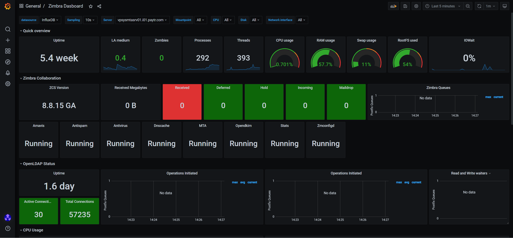

# Zimbra Monitoring on Grafana
## Configuration Telegraf


```sh
wget https://github.com/kzltp/grafana_zimbra/archive/refs/heads/main.zip
unzip main.zip
mv /etc/telegraf/telegraf.conf /etc/telegraf/telegraf.conf_ori
cp grafana_zimbra-main/telegraf.conf /etc/telegraf
sudo systemctl restart telegraf
```

# You should update some lines in telegraf.conf. 
 Line 5 --> urls = ["http://IP:8086"] # Input valid InfluxDB URL, IP address, and port
 Line 125 -->    host = "HOSTNAME" # Input Zimbra LDAP hostname
 Line 129 -->    bind_password = "PASS" # Input Zimbra LDAP bind user password. 

```sh
cp  grafana_zimbra-main/checkzimbrastatus.sh /opt/zimbra/common/bin/
cp grafana_zimbra-main/checkzimbraversion.sh /opt/zimbra/common/bin/
chmod +rwxr+xr+x /opt/zimbra/common/bin/checkzimbrastatus.sh
chmod +rwxr+xr+x /opt/zimbra/common/bin/checkzimbraversion.sh
crontab -e
```

# Insert cron rule
* * * * * /usr/sbin/service zimbra status > /tmp/status.tmp

```sh
sudo systemctl restart telegraf
```
and import Zimbra-Dasboard.json file on grafana.



